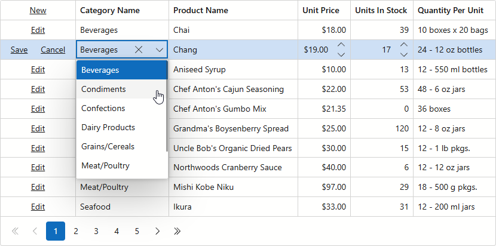

<!-- default badges list -->

<!-- default badges end -->

# Blazor Grid - Create a ComboBox (Foreign Key) Column

A foreign key is a database key used to manage relations between tables. You can use it to identify a specific column in the referenced table and obtain column data. This example demonstrates how to display this relationship in the [DevExpress Blazor Grid](https://docs.devexpress.com/Blazor/403143/components/grid) component.

Follow the steps below to create a foreign key column in the Grid component:

1. Add a [DxGridDataColumn](https://docs.devexpress.com/Blazor/DevExpress.Blazor.DxGridDataColumn) object to the Grid's column collection. Assign the name of the field that stores foreign keys to the column's [FieldName](https://docs.devexpress.com/Blazor/DevExpress.Blazor.DxGridDataColumn.FieldName) property.
2. Place [DxComboBoxSettings](https://docs.devexpress.com/Blazor/DevExpress.Blazor.DxComboBoxSettings) within the column's [EditSettings](https://docs.devexpress.com/Blazor/DevExpress.Blazor.DxGridDataColumn.EditSettings) tag.
3. Assign an external data source to the [Data](https://docs.devexpress.com/Blazor/DevExpress.Blazor.DxComboBoxSettings.Data) combo box setting.
4. Specify [ValueFieldName](https://docs.devexpress.com/Blazor/DevExpress.Blazor.DxComboBoxSettings.ValueFieldName) and [TextFieldName](https://docs.devexpress.com/Blazor/DevExpress.Blazor.DxComboBoxSettings.TextFieldName) settings to populate combo box items with values and text strings.

## Files to Review

- [Index.razor](./CS/GridForeignColumn/Pages/Index.razor)

## Documentation

* [Edit Data](https://docs.devexpress.com/Blazor/403454/components/grid/edit-data)

## More Examples

- [Blazor Grid - Post changes to an in-memory data source](https://github.com/DevExpress-Examples/blazor-dxgrid-instantly-update-data-item-fields)
